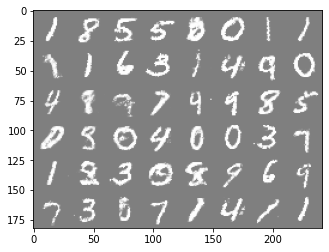

# Generative_Adversarial_Nets

This implementation uses MLP in both generator and discriminator.

*main.py* is used to train the model and it will automatically 
save the model to the folder *saved_models*.
*generate_images.py* is used to generate images using one of your 
saved model. The generated images will
be automatically saved in the folder *generated_images*.

Please ignore the current files in *saved_models* 
and *generated_images*. They have been trained 
for only 2 epochs. 

## Usage

```
usage: main.py [-h] [--dataset {mnist,cifar10}] [--data_dir DATA_DIR]
               [--epochs NUM_EPOCHS] [--batch_size BATCH_SIZE] [--k K]
               [--logD_times LOGD_TIMES] [--lr_G LR_G] [--lr_D LR_D]
               [--device DEVICE] [--save_dir SAVE_DIR] [--Nz NZ]

Demo for Training original GAN

optional arguments:
  -h, --help            show this help message and exit
  --dataset {mnist,cifar10}
                        Dataset to train the GAN
  --data_dir DATA_DIR   The directory of your dataset
  --epochs NUM_EPOCHS   Total number of epochs
  --batch_size BATCH_SIZE
                        The batch size
  --k K                 Train discriminator k times and then generator
  --logD_times LOGD_TIMES
                        Use the -log(D) trick for how many times
  --lr_G LR_G           Learning rate for the generator
  --lr_D LR_D           Learning rate for the discriminator
  --device DEVICE       Index of device
  --save_dir SAVE_DIR   The directory to save your trained model
  --Nz NZ               Nz (dimension of the latent code)
```

It can be seen by running

```
python3 main.py --help
```

## Generated Images

This implementation is not intended to reproduce the results in the paper. 
The generated images displayed below were produced by the model which
 had trained for 100 epochs.

